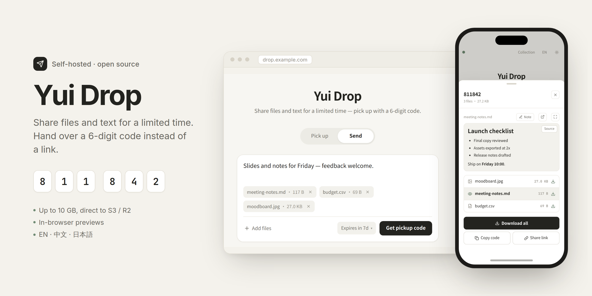

<div align="center">

<picture>
  <source media="(prefers-color-scheme: dark)" srcset="./docs/images/cover-dark.png">
  
</picture>

# Yui Drop

**Self-hosted file and text sharing. Hand over a 6-digit code instead of a link.**

[中文](./README.md) · English · [日本語](./README.ja.md)

[Quick start](#quick-start) · [Configuration](#configuration) · [Security](#security) · [API](#api) · [Live demo](https://drop.leod.me)

</div>

---

## What it is

Yui Drop is a small web app for handing files and text to someone else. You drop files, type a message, or both, and get a 6-digit pickup code back. The other person types the code on any device to preview or download what you sent. They don't need an account, an email address or a link — the code is short enough to read out loud.

Everything expires: after a number of days, or after a number of pickups, whichever you choose. Yui Drop runs as a single Docker container. It keeps metadata in SQLite and stores files on local disk (encrypted at rest) or in any S3-compatible bucket such as Cloudflare R2.

It is an independent rewrite inspired by [vastsa/FileCodeBox](https://github.com/vastsa/FileCodeBox). No code is shared with that project.

## Features

**Sending**
- One composer for everything: type text, paste screenshots, drag files in, or combine them. Text sent together with files arrives as a note above the file list.
- Up to 10 GB per file and 200 files per share (both configurable).
- Uploads to S3/R2 go straight from the browser to the bucket as resumable multipart uploads, so the API server never handles large files.
- Expiry by time (1 hour to a year) or by pickup count.

**Picking up**
- Six digit cells that open the share as soon as the last digit is typed. Pasting a code works too, and every share also has a direct link.
- In-browser previews for images, video, audio, PDF, Markdown, CSV/TSV (as a table), JSON, logs and source code. Each file can open in a new tab or in a full-screen viewer.
- Download a single file or all of them at once.

**Collections**
- Shared drop rooms: anyone with the room code can join, upload files and leave messages. The creator manages the room with its own admin password.

**Look and feel**
- Three switchable themes (Porcelain, Linear, Apple) with several accent colours each. The site name, title and intro text can be edited from the admin panel.
- Follows the system light/dark setting, with a manual toggle.
- English, 简体中文 and 日本語, detected from the browser.
- Designed mobile-first: bottom sheets and large touch targets on phones, and haptic feedback where the platform supports it. Animations turn off when the system asks for reduced motion.

**Administration**
- Admin panel with share search, previews, a recycle bin, access logs and storage settings.
- Sign in with a password, a passkey (WebAuthn), or your own OIDC provider.
- Admin-issued API keys for scripts and other apps (`/api/v1/*`).

## Quick start

### One-line install

```bash
curl -fsSL https://raw.githubusercontent.com/kurobaryo/yui-drop/main/scripts/install.sh | bash
```

The installer clones the repository into `./yui-drop`, generates `ADMIN_TOKEN`, `JWT_SECRET` and `SECRETS_KEY`, writes a starter `.env`, runs `docker compose up -d --build` and prints the admin URL. Then open <http://localhost:8000>. Files are stored on local disk by default.

### Manual install

```bash
git clone https://github.com/kurobaryo/yui-drop.git
cd yui-drop
cp .env.example .env
# Set ADMIN_TOKEN, JWT_SECRET and SECRETS_KEY (each file has generation hints),
# and optionally your S3 / R2 credentials.
docker compose up -d --build
```

Database migrations run automatically when the container starts.

### Local development

```bash
# Backend (Python 3.12)
cd backend
python -m venv .venv && source .venv/bin/activate
pip install -e ".[dev]"
alembic upgrade head
uvicorn app.main:app --reload --port 8000

# Frontend, in another terminal (Node 22)
cd frontend
pnpm install
pnpm dev        # http://localhost:5173, proxies /api to :8000
```

Tests: `cd backend && pytest`; type checks and build: `cd frontend && pnpm exec tsc --noEmit && pnpm build`.

## Configuration

All settings are environment variables in `.env`; [`.env.example`](./.env.example) lists every one with comments. The most important:

| Variable | Default | Purpose |
|---|---|---|
| `ADMIN_TOKEN` | — | Initial admin password (stored hashed) |
| `JWT_SECRET` | — | Signs admin sessions |
| `SECRETS_KEY` | — | 32-byte key that encrypts files on local disk and secrets stored in the database. The app refuses to start without it. |
| `APP_URL` / `ALLOWED_ORIGINS` | `http://localhost:8000` | Public URL and CORS allow-list. Never use `*` in production. |
| `STORAGE_BACKEND` | `local` | `local` or `s3` (any S3-compatible service, including Cloudflare R2) |
| `S3_ENDPOINT_URL`, `S3_BUCKET_NAME`, `S3_ACCESS_KEY_ID`, `S3_SECRET_ACCESS_KEY` | — | Bucket credentials when `STORAGE_BACKEND=s3` |
| `MAX_FILE_BYTES` | `10737418240` | Largest single file (10 GiB) |
| `MAX_FILES_PER_SHARE` | `200` | Files in one share |
| `STORAGE_QUOTA_BYTES` | unlimited | Total storage across all shares |
| `RATE_LIMIT_UPLOAD_PER_MIN` / `_PER_HOUR` / `_PER_DAY` | `5` / `30` / `200` | Per-IP upload limits |
| `RATE_LIMIT_RETRIEVE_FAILS_PER_HOUR` | `20` | Wrong codes allowed per IP before a temporary ban |
| `TURNSTILE_SITE_KEY` / `TURNSTILE_SECRET_KEY` | — | Optional Cloudflare Turnstile bot check |

Theme, storage backend, rate limits, sign-in methods and site text can also be changed at runtime from the admin panel. Those values are stored in the database, encrypted where they are secrets. `ADMIN_TOKEN`, `JWT_SECRET` and `SECRETS_KEY` only ever live in `.env`.

For production topology, R2 bucket CORS and reverse-proxy notes, see [`docs/DEPLOYMENT.md`](./docs/DEPLOYMENT.md).

## Security

Yui Drop is built for quick, everyday sharing. It is **not** end-to-end encrypted: the server can read what you upload. If you need zero-knowledge sharing, use a tool designed for it, such as [Magic Wormhole](https://github.com/magic-wormhole/magic-wormhole).

**Encryption**
- In transit: HTTPS everywhere. HSTS is sent when served over HTTPS.
- At rest: files on local disk are encrypted with AES-256-GCM using a separate key per share, wrapped by `SECRETS_KEY`. Objects in S3/R2 use the provider's AES-256 server-side encryption.
- Admin password and API keys are stored only as hashes.

**Serving uploaded files safely**
- The server derives each file's `Content-Type` from its extension. Types declared by the uploader are ignored.
- Only images, audio, video, PDF and plain text are shown inline. HTML, SVG, XML, scripts and everything else are always served as downloads.
- Every file response carries `X-Content-Type-Options: nosniff` and a sandboxed `Content-Security-Policy`, so even a mislabelled file cannot run script on the site's origin.
- Markdown is rendered with raw HTML disabled and sanitised with DOMPurify. Links to unsafe schemes become plain text, and remote images are never loaded automatically, so opening a share cannot ping a third-party server.

**Abuse protection**
- Pickup codes avoid easy patterns. Too many wrong codes from one IP trigger a temporary ban.
- Per-IP upload limits, a global storage quota and optional Turnstile.
- Multipart uploads are size-checked against the real object on completion, and abandoned sessions are cleaned up.
- Rate-limited admin login, with optional passkeys or OIDC.
- Strict site-wide CSP, `frame-ancestors 'self'`, `Referrer-Policy` and `Permissions-Policy`. All queries are parameterised. Filenames are sanitised and storage paths are generated server-side.

**Logs and retention**
- Access logs record IP and User-Agent for abuse handling. IP logging can be turned off in the admin panel.
- Expired shares move to a recycle bin. The admin can restore them or delete them permanently.

Please report vulnerabilities privately through [GitHub security advisories](https://github.com/kurobaryo/yui-drop/security/advisories/new) rather than opening a public issue.

## Architecture

```
Browser (React SPA) ──► FastAPI ──► SQLite (metadata)
        │                  │
        │   presigned      │   local disk (encrypted)
        └── multipart ────►└── or S3 / R2 bucket
```

- **Frontend**: React 18, TypeScript, Vite, Zustand, TanStack Query, react-i18next, markdown-it and DOMPurify.
- **Backend**: FastAPI, SQLAlchemy 2.0 (async), Alembic, Pydantic v2, cryptography.
- **Storage**: one `StorageBackend` interface with local and S3-compatible implementations.

More detail in [`docs/ARCHITECTURE.md`](./docs/ARCHITECTURE.md).

## API

Besides the internal endpoints the web app uses, Yui Drop offers a stable REST API at `/api/v1` for scripts and other apps. Admins issue keys from the panel, scoped to `upload` and/or `read`, with optional per-key quotas.

- `POST /api/v1/upload`: single-request upload for small files
- `POST /api/v1/upload/init`, then `sign-part` and `complete`: multipart upload straight to the bucket for large files
- `POST /api/v1/share/text`: create a text share
- `POST /api/v1/pickup`: resolve a pickup code
- `GET /api/v1/shares`, `GET /api/v1/shares/{code}`: list and inspect shares created with the key

```bash
YUI_DROP_API_KEY=yd_... ./scripts/yui-drop-upload.sh ./report.pdf
YUI_DROP_API_KEY=yd_... ./scripts/yui-drop-upload.py ./video.mp4 --expire-value 7 --expire-style day
```

The full reference is in [`docs/API.md`](./docs/API.md) and on every instance at `/docs`.

## Operations

The `yuidrop` CLI handles updates on a server:

```bash
sudo ./scripts/install-yuidrop.sh   # once
yuidrop update                      # pull, rebuild, migrate, health check
yuidrop rollback                    # back to the previous commit
```

See [`scripts/README.md`](./scripts/README.md).

## Repository layout

```
backend/    FastAPI app (api/, services/, models/, storage/), Alembic migrations, tests
frontend/   React app (v2/ is the current UI, pages/admin/ the admin panel, i18n/ translations)
scripts/    installer, yuidrop CLI, upload clients
docs/       architecture, deployment, API, images
```

## Roadmap

- Optional client-side encryption
- Password-protected shares
- Configurable pickup-code length
- Folder upload
- Virus-scan hook

## License

[MIT](./LICENSE)
